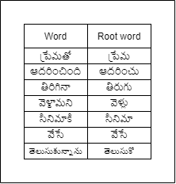

# Telugu-News-Categorization
 A NLP and ML based Application on Categorization of Telugu News.

### Process:
- Take the raw text from the input article.
   * Remove punctuations like full stop(.),comma(,),semicolon(;) etc.
   * Remove special characters like @,#,$,% etc.
- Tokenise the sentence.
   * Article is converted into tokens(words).
   * A sample output after removing punctuation and special character and tokenization.
    
   

    </img>
   

- Remove the stop words.
   * Check with the pre-defined stopwords list.
   * Stop words are which are most commonly repeating and don’t add much value to the text.
   * A subset of pre-defined stopwords.
    
   

    </img>
   

- Lemmatization.
   * Convert the words present in the sentence into their root word.
   * Using Lemmatization dictionary formed using telugu.lemma file.
   * A subset of the Lemmatization Dictionary.
    
   

    </img>
   

- Featue Vector Generation.
   * Used TF-IDF to generate Feature vectors.
- Model.
   * Used trained model to predict the category of the input article.
 
## Deployment:
- Hosted at: [telugu-news-categorization.herokuapp.com](https://telugu-news-categorization.herokuapp.com/)
### Usage:
- Copy any telugu news article from the news websites and paste it in the textarea present in website.
- Click on Check and Category of the news article will be displayed below the textarea by evaluating from the model.

### Contributors:
- Sai Rajeswar [@mrajeswarasai](https://github.com/mrajeswarasai)
- Krishna K
- Sudarshan C
